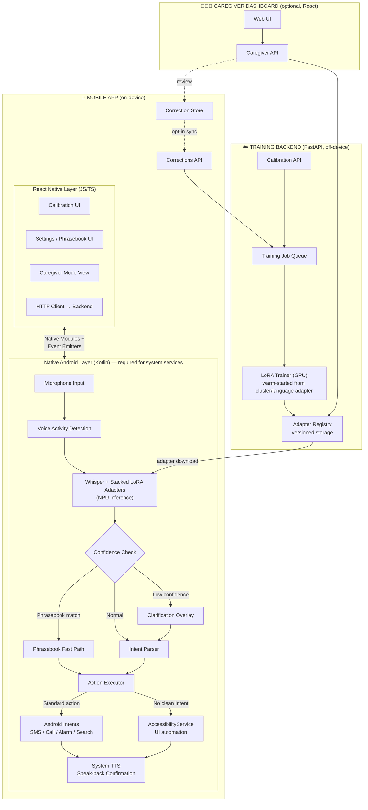
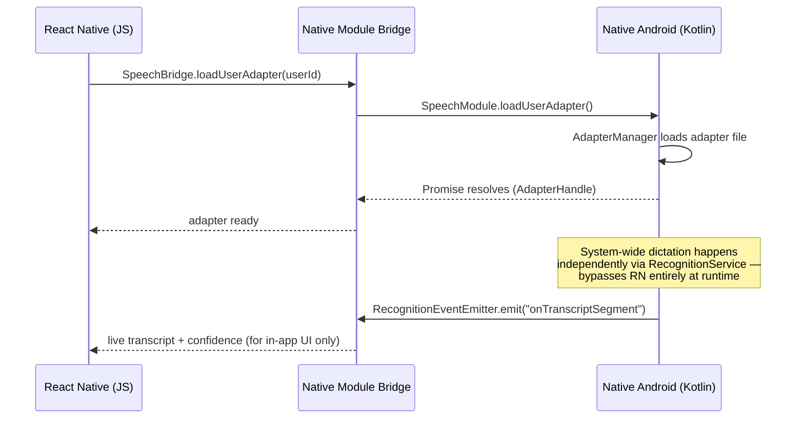
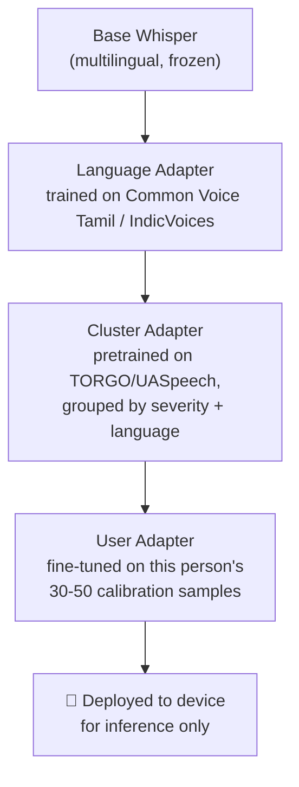
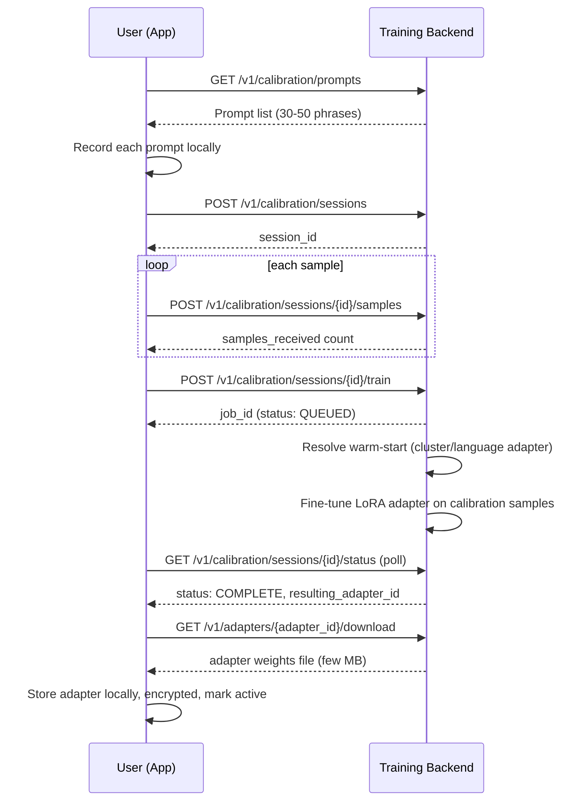
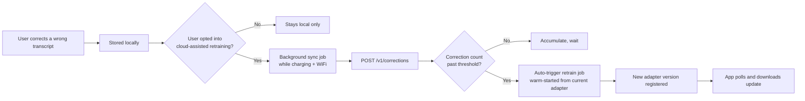
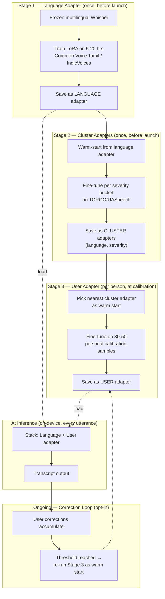

# 🗣️ Personalized On-Device Speech Assistant for Dysarthric Speech

**A free, open, fully on-device speech recognition system that personalizes to one person's speech pattern.**

Built for the ~7.5 million people worldwide with dysarthria — cerebral palsy, stroke, Parkinson's, ALS — whose speech mainstream voice assistants (Siri, Google Assistant) routinely fail to understand.

> *Voiceitt solved this for English speakers who can pay $600/year and wait through lengthy training. We're solving it for Tamil/Indian-language speakers, in minutes not hours, for free, entirely on-device, and working system-wide instead of inside one app.*

---

## Table of Contents

1. [Why this exists](#-why-this-exists)
2. [Features](#-features)
3. [Why we're better](#-why-were-better)
4. [System architecture](#-system-architecture)
5. [Pipelines & flowcharts](#-pipelines--flowcharts)
6. [ML training lifecycle](#-ml-training-lifecycle)
7. [Folder structure](#-folder-structure)
8. [Tech stack](#-tech-stack)
9. [Setup](#-setup)
10. [Datasets](#-datasets)
11. [Data requirements](#-how-much-data-is-actually-needed)
12. [Honest limitations](#-honest-limitations)
13. [Build roadmap](#-build-roadmap)

---

## 🎯 Why this exists

Mainstream voice assistants have documented, well-known failure rates on dysarthric speech. Google's own **Project Euphonia** research targeted this years ago and never shipped as a consumer, self-serve, on-device tool. **Voiceitt** is a real, shipped alternative — but it's expensive ($49.99/mo), closed-source, cloud-hybrid, and siloed to its own app, with unclear support for Indian languages. Tamil dysarthric speech recognition is documented in the literature as an open, largely unsolved problem — not a shipped product.

**This project closes that specific, named gap.**

---

## ✨ Features

### Core — assistant parity
- 🎙️ Voice dictation into any text field, in any app
- 💬 Send a message / place a call by contact name
- ⏰ Set alarms, timers, and reminders
- 🔍 Web search / open an app
- 🏠 Basic smart-home style actions

### Personalization — the actual thesis
- 🧠 One-time calibration: 30–50 short recordings → a personal LoRA adapter
- 🚀 **Cluster-adapter warm start** — new users begin from a severity-and-language-matched pretrained adapter instead of from zero, cutting calibration time from hours to minutes
- 📊 Live before/after accuracy comparison (generic Whisper vs. personalized) on a held-out phrase

### Differentiators — what makes this hackathon-worthy, not a clone
- ✅ **Confidence-gated clarification** — low-confidence words trigger a tap-to-confirm prompt instead of a silent wrong guess
- 📖 **Personal phrasebook** — high-frequency phrases mapped directly to actions, bypassing full parsing for speed and accuracy
- 🔁 **Active correction loop** — user corrections become future fine-tuning signal for that person's adapter
- 👨‍👩‍👧 **Caregiver mode** — a companion view to review low-confidence transcripts and manage the phrasebook
- 🔊 **AAC-lite speak-back** — spoken confirmation via system TTS before irreversible actions (send/call) fire
- 🌐 **Tamil–English code-switch handling** — built for how Indian users actually speak, not assumed monolingual
- 📱 **System-wide integration** — a registered Android `RecognitionService`, so personalized recognition works inside every app's existing mic button, not one dedicated silo app

---

## 🏆 Why we're better

| | Voiceitt | Project Euphonia / Relate | **This project** |
|---|---|---|---|
| Cost | $49.99/mo (~$600/yr) | Free (research, not shipped) | **Free** |
| Deployment | Cloud-hybrid | Never shipped self-serve | **Fully on-device at inference** |
| Scope | Its own app only | Its own app only | **System-wide, any app** |
| Language depth | Unclear outside English/major EU languages | English-centric | **Explicit Tamil / Indian-language focus** |
| Onboarding | Reported as time-consuming | N/A | **Cluster-adapter warm start — minutes** |
| Openness | Closed-source | Closed / research-only | **Open pipeline (Whisper + `peft`)** |

---

## 🏗️ System Architecture

The app is split into a **React Native UI layer** and a **native Android layer** — this split is required, not optional, because `RecognitionService` and `AccessibilityService` are Android system classes with no JS/RN equivalent.



---

## 🔄 Pipelines & Flowcharts

### 1. Speech-to-action pipeline (live usage)

```mermaid
flowchart LR
    A[User speaks] --> B[Mic capture + VAD]
    B --> C["Whisper base model<br/>(frozen)"]
    C --> D["+ Language LoRA adapter<br/>(Tamil accuracy boost)"]
    D --> E["+ User LoRA adapter<br/>(personal speech pattern)"]
    E --> F[Transcript + confidence scores]
    F --> G{Confidence & match check}
    G -->|Phrasebook hit| H[Direct action template]
    G -->|Low confidence| I[Clarify with user]
    G -->|Normal| J[Intent Parser]
    I --> J
    H --> K[Action Executor]
    J --> K
    K --> L{Standard Android<br/>Intent exists?}
    L -->|Yes| M["Fire Intent<br/>(SMS/Call/Alarm/Search)"]
    L -->|No| N["AccessibilityService<br/>taps/fills UI"]
    M --> O[TTS confirmation<br/>before send/call]
    N --> O
    O --> P[✅ Action completes]
```



### 2. React Native ↔ Native Android bridge



### 3. Two-adapter personalization stack



### 4. Calibration / onboarding flow



### 5. Correction → retraining loop



---

## 🧪 ML Training Lifecycle

Three separate training runs happen at three separate times, feeding into one stacked adapter at inference:



---

## 📁 Folder Structure

```
.
├── mobile-app/                          # React Native app + embedded native Android module
│   ├── src/                             # React Native (JS/TS) — UI, state, networking
│   │   ├── screens/
│   │   │   ├── CalibrationScreen.tsx
│   │   │   ├── SettingsScreen.tsx
│   │   │   ├── PhrasebookScreen.tsx
│   │   │   ├── CaregiverModeScreen.tsx
│   │   │   └── TranscriptHistoryScreen.tsx
│   │   ├── native/
│   │   │   ├── SpeechBridge.ts          # typed wrapper around native module
│   │   │   ├── AccessibilityBridge.ts
│   │   │   └── types.ts
│   │   ├── api/
│   │   │   ├── trainingBackendClient.ts
│   │   │   └── dto.ts
│   │   ├── state/                       # Redux/Zustand — adapter status, phrasebook cache
│   │   ├── storage/
│   │   │   └── localDb.ts               # SQLite / WatermelonDB
│   │   └── App.tsx
│   ├── android/                         # native Android project (required)
│   │   └── app/src/main/java/.../
│   │       ├── audio/
│   │       │   ├── AudioCaptureManager.kt
│   │       │   └── VoiceActivityDetector.kt
│   │       ├── stt/
│   │       │   ├── WhisperInferenceEngine.kt
│   │       │   ├── AdapterManager.kt
│   │       │   └── ConfidenceScorer.kt
│   │       ├── recognition/
│   │       │   └── PersonalizedRecognitionService.kt
│   │       ├── nlu/
│   │       │   ├── IntentParser.kt
│   │       │   └── PhrasebookMatcher.kt
│   │       ├── actions/
│   │       │   ├── ActionExecutor.kt
│   │       │   ├── AndroidIntentActions.kt
│   │       │   └── AccessibilityActionService.kt
│   │       ├── tts/
│   │       │   └── SpeakBackManager.kt
│   │       ├── bridge/
│   │       │   ├── SpeechModule.kt
│   │       │   ├── SpeechModulePackage.kt
│   │       │   ├── AccessibilityModule.kt
│   │       │   └── RecognitionEventEmitter.kt
│   │       └── security/
│   │           └── KeystoreCrypto.kt
│   ├── ios/                             # RN scaffold present; STT/action parity is Android-only
│   └── package.json
│
├── training-backend/                    # FastAPI service
│   ├── app/
│   │   ├── main.py
│   │   ├── routers/
│   │   │   ├── auth.py
│   │   │   ├── calibration.py
│   │   │   ├── adapters.py
│   │   │   ├── corrections.py
│   │   │   └── caregiver.py
│   │   ├── models/                      # Pydantic schemas
│   │   ├── db/                          # SQLAlchemy models + migrations
│   │   ├── workers/
│   │   │   └── train_worker.py
│   │   └── storage/                     # object storage client
│   ├── ml/
│   │   ├── train_lora_whisper.py
│   │   └── adapters/                    # seed adapters (e.g. torgo_cluster_english_v1/)
│   └── requirements.txt
│
├── notebooks/
│   └── torgo_whisper_lora_colab.ipynb   # standalone Colab training notebook
│
└── docs/
    ├── dysarthric-asr-implementation.md      # product architecture, features, demo script
    └── technical-implementation-spec.md      # full API contracts, schemas, sequence flows
```

---

## 🛠️ Tech Stack

| Layer | Technology |
|---|---|
| Mobile UI | React Native (TypeScript) |
| Native Android bridge | Kotlin, React Native Native Modules + Event Emitters |
| STT | OpenAI Whisper (small/base, multilingual), quantized |
| On-device inference | ONNX Runtime Mobile (QNN execution provider) or whisper.cpp, running on Snapdragon NPU |
| Personalization | LoRA via 🤗 `peft` |
| System integration | `android.speech.RecognitionService`, `android.accessibilityservice.AccessibilityService` |
| TTS | Android system `TextToSpeech` |
| Local storage | Room DB (native) + SQLite/WatermelonDB (RN) |
| Backend | Python, FastAPI |
| Backend DB | SQLAlchemy (Postgres/SQLite) |
| Training | 🤗 `transformers`, `datasets`, `peft`, `accelerate`, `jiwer` |
| Caregiver dashboard | React (optional) |
| Security | Android Keystore-backed encryption at rest |

---

## 🚀 Setup

### Training backend
```bash
cd training-backend
pip install -r requirements.txt
uvicorn app.main:app --reload
```

### LoRA training (standalone / Colab)
```bash
cd training-backend/ml
pip install transformers datasets peft accelerate jiwer soundfile librosa evaluate
python train_lora_whisper.py
```
Or open `notebooks/torgo_whisper_lora_colab.ipynb` directly in Google Colab for a guided, cell-by-cell run.

### Mobile app
```bash
cd mobile-app
npm install
npx react-native run-android   # requires a physical device for RecognitionService/NPU testing
```
On first launch, set the app as the system voice input method: **Settings → System → Languages & input → Voice input**.

---

## 📊 Datasets

| Dataset | Purpose | Access |
|---|---|---|
| **TORGO** | English dysarthric cluster-adapter pretraining | Free — `cs.toronto.edu/~complingweb/data/TORGO`, or preprocessed mirror `huggingface.co/datasets/abnerh/TORGO-database` |
| **UASpeech** | English dysarthric, severity-labeled | Requires signed license agreement (University of Illinois) |
| **Common Voice — Tamil** | Language adapter (general Tamil accuracy) | Free — `commonvoice.mozilla.org` |
| **AI4Bharat IndicVoices / IndicVoices-R (Tamil)** | Language adapter, natural Tamil speech | Free — `huggingface.co/datasets/ai4bharat/IndicVoices` |
| **Tamil dysarthric speech** | — | **Does not publicly exist.** This project uses disclosed proxy-speaker recordings for the Tamil demo — a genuine gap, stated openly rather than worked around. |

---

## 📏 How much data is actually needed

| Adapter | Data needed | Why |
|---|---|---|
| **Language adapter** (Tamil general) | 5–20 hours of clean Tamil speech | Closes Whisper's baseline weakness on Tamil, not dysarthria specifically — one-time cost |
| **Cluster adapter** (severity-matched) | Full available TORGO subset per severity group | Gives new users a far better starting point than raw Whisper |
| **User adapter** (per-person) | 30–50 short phrases (~5–10 min audio) | Visible improvement on calibration-similar phrases — not full clinical-grade generalization |

Literature reference point: full fine-tuning took a 128% WER baseline (unusable) down to 15.8% with just 1.4 hours of data, and to 9.7% with ~22.5+ hours. Our 30–50 sample calibration set sits below the 1.4-hour mark by design — the claim is "visibly better, in minutes," not "clinically solved."

---

## ⚠️ Honest Limitations

- Calibration samples are recorded and reviewed before live demos, not collected on stage.
- On-device training is not implemented — all adapter fine-tuning happens on the backend; the phone runs inference only.
- LoRA is used over full fine-tuning as a deliberate storage/scalability tradeoff (per-user adapters vs. per-user full models) — literature shows full fine-tuning can outperform LoRA in raw accuracy on this task.
- Tamil dysarthric demos rely on a proxy speaker mimicking dysarthric speech patterns, not a clinically validated dataset.
- This closes a *personalization* gap for individual users — it is not a claim of general-purpose ASR robustness.
- The React Native ↔ native Android bridge is the highest-risk integration point in this stack; a native fallback demo path should always be kept ready.

---

## 🗺️ Build Roadmap

1. Backend: `auth`, `calibration` routers + DB models
2. `train_lora_whisper.py` wired into `train_worker.py`
3. Native Android: raw STT pipeline (base Whisper only) as a standalone test harness
4. Native ↔ RN bridge scaffolding (`SpeechModule`, `RecognitionEventEmitter`) — highest risk, build and test early
5. RN: minimal screen calling `transcribeFile()` to prove the bridge end-to-end
6. Native: `AdapterManager` + backend `adapters` router — personalization wired in
7. Native: `PersonalizedRecognitionService` registration — system-wide dictation
8. Native: `IntentParser` + `ActionExecutor` (Android Intents first, `AccessibilityService` fallback later)
9. Native: `SpeakBackManager` (system TTS) confirmation flow
10. RN: full `CalibrationScreen` + `PhrasebookScreen` flows
11. Corrections capture + opt-in sync
12. Caregiver dashboard — if time remains

---

## 📄 License

Choose and add a license (MIT/Apache-2.0 recommended for the open-source positioning this project is built around).
