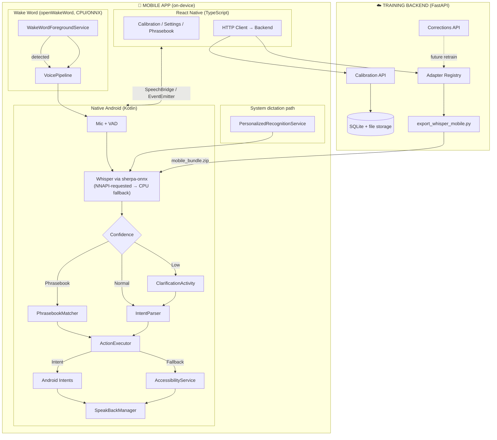
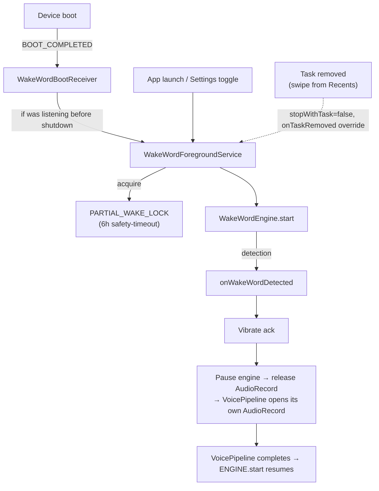
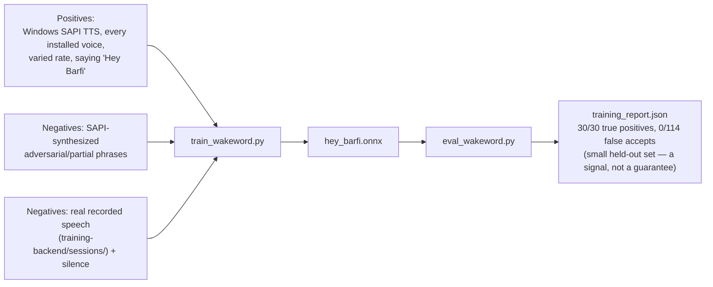
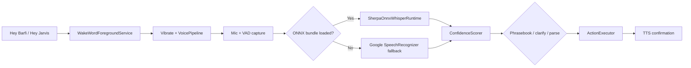
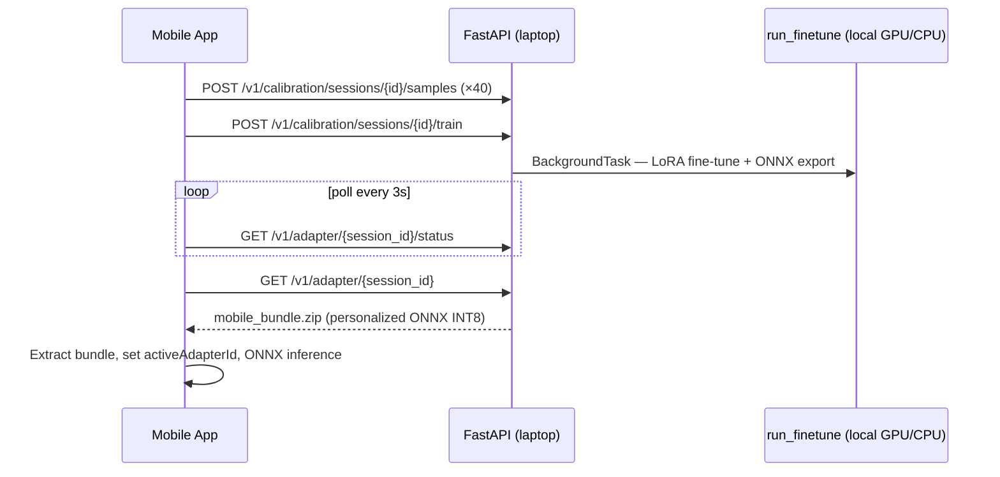

# 🗣️ VaaniMitra — Personalized On-Device Speech Assistant for Dysarthric Speech

**A free, open, on-device speech recognition system that personalizes to one person's speech pattern.**

Built for people with dysarthria — cerebral palsy, stroke, Parkinson's, ALS — whose speech mainstream voice assistants routinely fail to understand.

> *Voiceitt solved this for English speakers who can pay $600/year. VaaniMitra targets Tamil/Indian-language speakers, works system-wide on Android, and keeps inference on-device.*

---

## Table of Contents

1. [Why this exists](#-why-this-exists)
2. [Features](#-features)
3. [System architecture](#-system-architecture)
4. [Voice activation modes](#-voice-activation-modes)
5. [Pipelines](#-pipelines)
6. [Folder structure](#-folder-structure)
7. [Tech stack](#-tech-stack)
8. [Setup](#-setup)
9. [Current status & limitations](#-current-status--limitations)
10. [Datasets](#-datasets)
11. [License](#-license)

---

## 🎯 Why this exists

Mainstream voice assistants have documented failure rates on dysarthric speech. Google's **Project Euphonia** never shipped as a consumer, self-serve, on-device tool. **Voiceitt** is expensive ($49.99/mo), closed-source, cloud-hybrid, and siloed to its own app. Tamil dysarthric speech recognition remains largely unsolved in consumer products.

**VaaniMitra closes that personalization gap** — cluster-adapter warm start, on-device ONNX inference, and system-wide Android integration.

---

## ✨ Features

### Core — assistant parity
- 🎙️ Voice dictation into any text field, in any app (via `RecognitionService`)
- 💬 Send a message / place a call by contact name
- ⏰ Set alarms, timers, and reminders
- 🔍 Web search / open an app
- 🏠 Basic smart-home style actions

### Personalization
- 🧠 Calibration flow: record 40 short phrases → **local fine-tune on your laptop** → download personalized ONNX bundle
- 🚀 **Cluster-adapter warm start** — per-user LoRA fine-tunes from merged TORGO weights, not raw Whisper
- 📦 **Merged ONNX bundle** — LoRA is baked into a single on-device Whisper ONNX package (no runtime adapter stacking)
- 🔄 **Cluster fallback** — if training fails or times out, app auto-loads the pre-baked cluster adapter

### Differentiators
- ✅ **Confidence-gated clarification** — low-confidence words trigger a tap-to-confirm prompt
- 📖 **Personal phrasebook** — high-frequency phrases mapped directly to actions
- 🔁 **Active correction loop** — user corrections can sync to the backend for future retraining (opt-in)
- 👨‍👩‍👧 **Caregiver mode** — PIN-gated screen to review transcripts and manage the phrasebook
- 🔊 **AAC-lite speak-back** — TTS confirmation before irreversible actions (send/call)
- 🎤 **Hands-free wake word** — openWakeWord foreground service running a custom-trained "Hey Barfi" classifier (dev fallback: "Hey Jarvis")
- 🔁 **Survives backgrounding (with a documented OEM caveat)** — `stopWithTask="false"` + a partial wake lock + a `BOOT_COMPLETED` receiver keep the listener alive across task-removal and reboot; see [Known limitations](#-current-status--limitations) for the one OEM skin where it still stops
- 📱 **System-wide integration** — works inside every app's keyboard mic, not just inside VaaniMitra

---

## 🏗️ System Architecture

The app splits into a **React Native UI layer** and a **native Android layer**. `RecognitionService`, `AccessibilityService`, ONNX inference, and the wake-word foreground service must run in Kotlin — there is no JS equivalent.



### Adapter lifecycle (server → device)

```mermaid
flowchart LR
    LORA["LoRA weights<br/>(PEFT safetensors)"] --> MERGE["export_whisper_mobile.py<br/>merge + ONNX + optional INT8"]
    MERGE --> ZIP["mobile_bundle.zip"]
    ZIP -->|GET /v1/adapters/{id}/mobile| DEVICE["SherpaOnnxWhisperRuntime<br/>on Android"]
```

At inference the device loads **one merged ONNX bundle** per adapter — not stacked LoRA at runtime.

### Wake-word service lifecycle (persistence across backgrounding & reboot)

`WakeWordEngine` holds `AudioRecord` continuously while active, so the service that owns it has to survive far more than a normal Activity lifecycle — task removal from Recents, Doze, and device reboot all had to be handled explicitly:



**Confirmed real hardware limitation (vivo/OriginOS):** the above keeps the *process* alive and correctly classified as a protected foreground service (`dumpsys activity processes` shows `mAdjType=fg-service-act cached=false`), but on vivo's OriginOS the mic still silently stops receiving audio within seconds of the Activity losing visibility — enforced by a vivo-proprietary layer (likely `com.vivo.abe`, its signature-permission-gated "Application Behavior Engine") below Android's own importance system, with no app-level fix found. See `mobile-app/android/app/src/main/assets/README_WAKEWORD.md` for the full list of things that were tried. **Net effect: treat "Hey Barfi" as reliable while the app is open/foregrounded; the manual tap-mic path has no such limitation.**

---

## 🎤 Voice activation modes

| Mode | How it works |
|---|---|
| **Hands-free ("Hey Barfi")** | Toggle in Settings under "Listen for Hey Barfi" → `WakeWordForegroundService` runs in foreground → vibrate on wake → `VoicePipeline` captures command → ONNX Whisper → intent → TTS-gated action. Reliable while the app is open/foregrounded — see the OEM caveat above for backgrounded behavior on some devices. |
| **Manual tap-to-talk (always available)** | Tap the mic on `ListeningScreen` → same `VoicePipeline` capture → transcribe → act. No backgrounding caveat, since capture only ever starts while the screen is open. |
| **System dictation (fallback)** | Set VaaniMitra as default voice input → tap the keyboard mic in any app → `PersonalizedRecognitionService` |
| **Dev wake phrase fallback** | If `hey_barfi.onnx` is missing from assets (e.g. a fresh clone before running the wake-word setup), the app falls back to **"Hey Jarvis"** (`hey_jarvis_v0.1.onnx`) |

Wake word runs on **CPU** (openWakeWord ONNX). Whisper runs on **NNAPI** with CPU fallback.

### Training a custom wake word ("Hey Barfi")

`hey_barfi.onnx` is trained by fitting openWakeWord's classifier head directly on top of its pretrained melspectrogram/embedding feature extractors — not via openWakeWord's own reference pipeline (which wants Piper TTS, a GPU, and several GB of room-impulse-response/background datasets):



Regenerate with `python training-backend/ml/train_wakeword.py` (data-generation scripts live under `training-backend/ml/wakeword/`); both `wakeword_data/` and the model output are gitignored and rebuilt from scratch, not checked in.

---

## 🔄 Pipelines

### Speech-to-action (hands-free)



### Calibration → fine-tune → deploy (local laptop)



Audio never leaves your machine. Set `API_HOST` in `mobile-app/src/config/backend.ts` and use `adb reverse tcp:8000 tcp:8000` for USB debugging.

---

## 📁 Folder Structure

```
.
├── mobile-app/                              # React Native 0.74 + embedded Android
│   ├── src/
│   │   ├── screens/                         # Listening, Calibration, Settings, Phrasebook, Caregiver
│   │   ├── native/SpeechBridge.ts           # RN ↔ Kotlin bridge
│   │   ├── api/trainingBackendClient.ts
│   │   ├── services/adapterService.ts       # Mobile bundle download + persistence
│   │   └── App.tsx                          # Boot: auth, restore adapters, wake word
│   └── android/app/
│       ├── libs/                            # sherpa-onnx prebuilt AAR (gitignored, checksum-verified)
│       └── src/main/
│           ├── assets/                      # Wake-word ONNX models (gitignored) + README_WAKEWORD.md
│           └── java/com/vaanimitra/
│               ├── wakeword/                # WakeWordForegroundService, WakeWordBootReceiver (openWakeWord)
│               ├── pipeline/                # VoicePipeline, ConfirmationGate
│               ├── audio/                   # AudioCaptureManager, VoiceActivityDetector
│               ├── stt/                     # SherpaOnnxWhisperRuntime, ModelBundleManager, AdapterManager
│               ├── recognition/             # PersonalizedRecognitionService
│               ├── nlu/                     # IntentParser, PhrasebookMatcher
│               ├── actions/                 # ActionExecutor, Android intents
│               ├── tts/                     # SpeakBackManager
│               └── bridge/                  # SpeechModule, RecognitionEventEmitter
│
├── training-backend/                        # FastAPI service
│   ├── app/routers/                         # auth, calibration, calibrate, session_adapter, adapters
│   ├── app/services/session_status.py       # Pollable status.json per session
│   └── ml/
│       ├── adapters/                        # LoRA weights + adapter_manifest.json
│       ├── sherpa_whisper_export/           # HF Whisper → sherpa-onnx KV-cache export helpers
│       ├── wakeword/                        # SAPI TTS sample-generation scripts (positives/negatives)
│       ├── wakeword_data/                   # Generated training/eval audio (gitignored, regenerable)
│       ├── run_finetune.py                  # Local fine-tune + auto ONNX export
│       ├── run_pipeline.py                  # One-command export → eval → conditional deploy
│       ├── export_whisper_mobile.py         # LoRA → merged ONNX → mobile_bundle.zip
│       ├── hf_to_openai_whisper.py          # HF checkpoint → OpenAI Whisper format (for sherpa-onnx export)
│       ├── train_wakeword.py                # Trains hey_barfi.onnx on openWakeWord's feature extractors
│       ├── eval_wakeword.py                 # True-positive / false-accept report for hey_barfi.onnx
│       ├── push_bundle_to_phone.py          # adb-push a mobile bundle without the full pipeline
│       ├── requirements-training.txt        # torch/peft/datasets for live fine-tune
│       ├── requirements-export.txt
│       └── MOBILE_SETUP.md                  # Detailed mobile export guide
│
├── scripts/
│   ├── download_wakeword_models.py          # openWakeWord ONNX assets → Android assets/ (cross-platform)
│   ├── download_sherpa_onnx_aar.py          # Fetches the pinned sherpa-onnx AAR (checksum-verified)
│   └── generate_wakeword_onnxruntime_shim.py # Patches a renamed libonnxruntime.so so openWakeWord + sherpa-onnx coexist
│
├── technical-implementation-spec.md         # API contracts, schemas, sequence flows
└── docs/
    ├── SHERPA_ONNX_CONTRACT.md              # Backend↔device contract for the sherpa-onnx migration
    ├── CALIBRATION_PIPELINE.md              # End-to-end 7-step calibration pipeline spec
    ├── QNN_INTEGRATION.md                   # Snapdragon NPU (QNN) execution provider — not yet implemented
    ├── implementation.md
    └── lit_review.md
```

---

## 🛠️ Tech Stack

| Layer | Technology |
|---|---|
| Mobile UI | React Native 0.74 (TypeScript), React Navigation |
| State | Zustand, AsyncStorage |
| Native Android | Kotlin — `RecognitionService`, `AccessibilityService`, foreground service |
| STT (on-device) | Whisper-small + merged LoRA → **sherpa-onnx** `OfflineRecognizer` (k2-fsa/sherpa-onnx, prebuilt AAR, NNAPI-requested → CPU fallback) |
| STT (fallback) | Google `SpeechRecognizer` when no sherpa-onnx bundle is loaded |
| Wake word | **openWakeWord** (`xyz.rementia:openwakeword`) — ONNX on CPU, no API key; custom "Hey Barfi" classifier head trained on synthetic TTS + real speech (`training-backend/ml/train_wakeword.py`) |
| Personalization | LoRA via 🤗 `peft` (server-side); merged at export for mobile |
| TTS | Android system `TextToSpeech` |
| Backend | Python, FastAPI, SQLAlchemy (SQLite by default) |
| Export tooling | `openai-whisper`, `onnxruntime`, `transformers`, `peft` (`ml/requirements-export.txt`) — see `docs/SHERPA_ONNX_CONTRACT.md` |

---

## 🚀 Setup

### Prerequisites

- Python 3.10+, Node 20 recommended, Android SDK
- Physical Android device + USB cable (or emulator)
- ~4 GB disk for training/export deps + ONNX models
- TORGO cluster weights in `training-backend/ml/adapters/torgo_base_adapter_english_v1/`

### 1. Training backend

```bash
cd training-backend
python -m venv venv && source venv/bin/activate
pip install -r requirements.txt
pip install -r ml/requirements-training.txt   # torch, peft, datasets — for live fine-tune
uvicorn app.main:app --reload --port 8000
```

Verify: `curl http://127.0.0.1:8000/health` → `{"status":"ok","live_training_enabled":true}`

Optional `.env`: `SECRET_KEY`, `LIVE_TRAINING_ENABLED=false` (cluster-only mode, no torch needed).

### 1b. Connect phone to laptop backend

| Setup | `mobile-app/src/config/backend.ts` | Extra step |
|---|---|---|
| **USB (recommended)** | `API_HOST = '127.0.0.1'` | `adb reverse tcp:8000 tcp:8000` |
| **Android emulator** | `API_HOST = '10.0.2.2'` | none |
| **Phone hotspot** | `API_HOST = '<laptop-LAN-IP>'` | same WiFi/hotspot network |

Audio uploads go to your **local** FastAPI server — never a cloud host.

### 2. Export mobile sherpa-onnx bundle (required for on-device Whisper)

```bash
cd training-backend
python -m venv .venv-export && source .venv-export/bin/activate
pip install -r ml/requirements-export.txt
python ml/export_whisper_mobile.py \
  --adapter-dir ml/adapters/torgo_base_adapter_english_v1 \
  --output-dir ml/mobile_export/torgo_base_adapter_english_v1 \
  --quantize
```

**Or run the whole thing in one command** — export, evaluate, deploy:

```bash
python ml/run_pipeline.py
```

It finds the trained adapter under `sessions/` on its own. If several exist it
lists them so you can pick with `--adapter-dir`.

This exports the bundle, measures word error rate against the held-out clips that
training reserved, and installs to the phone **only if the new adapter beat the
baseline**. If it did not, nothing is deployed and the model already on the device
is left alone — see `eval_report.json` for the per-sample comparison.

Useful flags: `--device <serial>` when several phones are attached, `--baseline
<adapter-dir>` to compare against a specific adapter rather than the base model,
`--min-improvement 0.02` to require a 2-point WER drop, and `--skip-push` to build
without deploying. `--skip-eval` exists for sessions with no held-out audio, but
it deploys a model whose quality is unknown.

Windows note: use `python` (not `python3`). The pipeline resolves `adb` from PATH;
pass `--adb C:\path\to\adb.exe` if it is not there.

See `training-backend/ml/MOBILE_SETUP.md` for full details. The backend serves the zip at `GET /v1/adapters/{adapter_id}/mobile`.

### 3. Wake word models (one-time after clone)

Cross-platform (Windows, macOS, Linux):

```bash
python scripts/download_wakeword_models.py
```

<details><summary>macOS/Linux shell equivalent</summary>

```bash
chmod +x scripts/download_wakeword_models.sh
./scripts/download_wakeword_models.sh
```
</details>

Downloads `melspectrogram.onnx`, `embedding_model.onnx`, and `hey_jarvis_v0.1.onnx` into `mobile-app/android/app/src/main/assets/` (gitignored — these are the shared feature extractors and the dev fallback model).

Then train the actual `hey_barfi.onnx` wake word (SAPI-TTS + real-speech negatives, no GPU or Piper needed):

```bash
cd training-backend
python ml/train_wakeword.py
python ml/eval_wakeword.py   # prints true-positive / false-accept report
```

This writes `hey_barfi.onnx` into `mobile-app/android/app/src/main/assets/`, where the app prefers it over the "Hey Jarvis" fallback. See `mobile-app/android/app/src/main/assets/README_WAKEWORD.md` for the training approach and a documented OEM background-listening limitation (vivo/OriginOS).

### 4. sherpa-onnx Android AAR (one-time after clone)

sherpa-onnx publishes no Maven artifact — this fetches the pinned prebuilt AAR (see `docs/SHERPA_ONNX_CONTRACT.md` for the exact version and why it's pinned) into `mobile-app/android/app/libs/` (gitignored, checksum-verified):

```bash
python scripts/download_sherpa_onnx_aar.py
```

sherpa-onnx and openWakeWord each bundle their own, binary-incompatible `libonnxruntime.so` (see `docs/SHERPA_ONNX_CONTRACT.md` — this crashes the app on launch if skipped). Generate the patched shim that lets both coexist:

```bash
python scripts/generate_wakeword_onnxruntime_shim.py
```

### 5. Mobile app

```bash
cd mobile-app
npm install
npm run android
```

`npm run android` sets `ANDROID_HOME` and platform-tools on `PATH`.

**On device:**
1. Complete calibration or Settings → download voice model
2. Either say **"Hey Barfi"** (toggle "Listen for Hey Barfi" in Settings; falls back to "Hey Jarvis" if the custom model hasn't been trained yet) or just tap the mic on the Listening screen — both feed the same `VoicePipeline`
3. Optional fallback: **Settings → Languages & input → Voice input → VaaniMitra**

**If Android build fails** with `rn_edit_text_material 2.xml`, clean macOS duplicate artifacts:

```bash
rm -rf mobile-app/android/app/build mobile-app/android/build
find mobile-app/android -name '* 2*' -delete
cd mobile-app/android && ./gradlew clean
```

---

## ⚠️ Current status & limitations

| Area | Status |
|---|---|
| On-device Whisper (sherpa-onnx) | ✅ `SherpaOnnxWhisperRuntime` — KV-cache encoder/decoder, NNAPI-requested → CPU fallback |
| Wake word (openWakeWord) | ✅ Custom `hey_barfi.onnx` trained and evaluated (30/30 TP, 0/114 FA on a small held-out set) — see `train_wakeword.py` / `eval_wakeword.py` |
| Wake-word persistence | ✅ Survives task removal (`stopWithTask=false`) and reboot (`WakeWordBootReceiver`) at the Android process level |
| Wake-word background listening | ⚠️ Confirmed broken on vivo/OriginOS specifically — the mic stops within seconds of the app losing screen visibility, enforced below Android's own process-importance system (likely `com.vivo.abe`). Reliable while the app is foregrounded; the manual tap-mic path is unaffected. See `README_WAKEWORD.md`. |
| Manual tap-to-talk | ✅ Always available on `ListeningScreen`, same `VoicePipeline` as wake-word capture |
| System-wide dictation | ✅ `PersonalizedRecognitionService` |
| Calibration sample upload | ✅ Multipart to local FastAPI |
| Live per-user LoRA training | ✅ `run_finetune.py` — TORGO warm-start, encoder frozen, decoder LoRA r=4 |
| sherpa-onnx export after train | ✅ HF→OpenAI conversion + KV-cache ONNX + INT8 quant (same pipeline as CLI export) |
| Session polling + download | ✅ `GET /v1/adapter/{session_id}/status` + `/adapter/{session_id}` |
| Cluster fallback | ✅ On training failure, timeout, or `LIVE_TRAINING_ENABLED=false` |
| iOS | Scaffold only — Android is the target platform |
| Per-utterance STT confidence | Not available from sherpa-onnx's greedy-search API — see `docs/SHERPA_ONNX_CONTRACT.md`; `ConfidenceScorer` falls back to a text-length heuristic |
| QNN / Snapdragon NPU EP | Not wired — sherpa-onnx requests NNAPI, not Qualcomm QNN (needs a from-source build against the Qualcomm SDK; see `docs/QNN_INTEGRATION.md`) |

Fine-tune requires `pip install -r ml/requirements-training.txt`. GPU recommended; CPU works but is slower (~minutes for 40 clips).

---

## 📊 Datasets

| Dataset | Purpose | Access |
|---|---|---|
| **TORGO** | English dysarthric cluster-adapter pretraining | Free — [TORGO](https://www.cs.toronto.edu/~complingweb/data/TORGO) / [HuggingFace mirror](https://huggingface.co/datasets/abnerh/TORGO-database) |
| **UASpeech** | English dysarthric, severity-labeled | Signed license (University of Illinois) |
| **Common Voice — Tamil** | Language adapter (general Tamil) | Free — [commonvoice.mozilla.org](https://commonvoice.mozilla.org) |
| **AI4Bharat IndicVoices** | Natural Tamil speech | Free — [HuggingFace](https://huggingface.co/datasets/ai4bharat/IndicVoices) |
| **Tamil dysarthric speech** | — | **No public corpus** — disclosed limitation for Tamil demos |

---

## 📄 License

Choose and add a license (MIT/Apache-2.0 recommended for the open-source positioning).

**Related docs:** `technical-implementation-spec.md` · `docs/SHERPA_ONNX_CONTRACT.md` · `docs/CALIBRATION_PIPELINE.md` · `docs/QNN_INTEGRATION.md` · `training-backend/ml/MOBILE_SETUP.md` · `mobile-app/android/app/src/main/assets/README_WAKEWORD.md`
