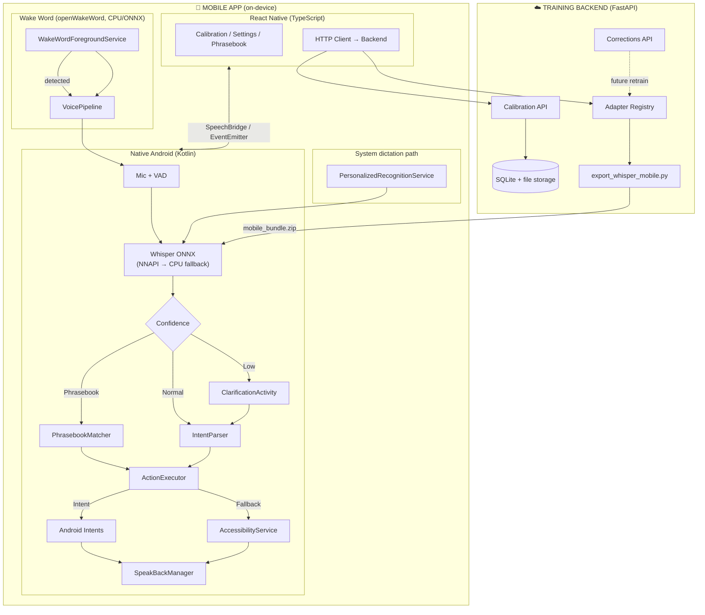
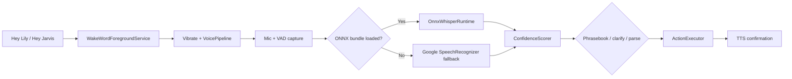
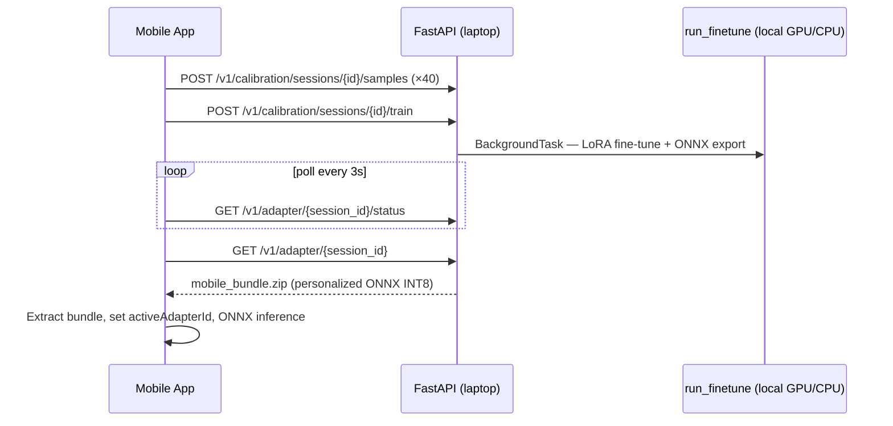

# 🗣️ VaaniMitra — Personalized On-Device Speech Assistant for Dysarthric Speech

**A free, open, on-device speech recognition system that personalizes to one person's speech pattern.**

Built for people with dysarthria — cerebral palsy, stroke, Parkinson's, ALS — whose speech mainstream voice assistants routinely fail to understand.

> *Voiceitt solved this for English speakers who can pay $600/year. VaaniMitra targets Tamil/Indian-language speakers, works system-wide on Android, and keeps inference on-device.*

---

## Table of Contents

1. [Why this exists](#-why-this-exists)
2. [Features](#-features)
3. [System architecture](#-system-architecture)
4. [Voice activation modes](#-voice-activation-modes)
5. [Pipelines](#-pipelines)
6. [Folder structure](#-folder-structure)
7. [Tech stack](#-tech-stack)
8. [Setup](#-setup)
9. [Current status & limitations](#-current-status--limitations)
10. [Datasets](#-datasets)
11. [License](#-license)

---

## 🎯 Why this exists

Mainstream voice assistants have documented failure rates on dysarthric speech. Google's **Project Euphonia** never shipped as a consumer, self-serve, on-device tool. **Voiceitt** is expensive ($49.99/mo), closed-source, cloud-hybrid, and siloed to its own app. Tamil dysarthric speech recognition remains largely unsolved in consumer products.

**VaaniMitra closes that personalization gap** — cluster-adapter warm start, on-device ONNX inference, and system-wide Android integration.

---

## ✨ Features

### Core — assistant parity
- 🎙️ Voice dictation into any text field, in any app (via `RecognitionService`)
- 💬 Send a message / place a call by contact name
- ⏰ Set alarms, timers, and reminders
- 🔍 Web search / open an app
- 🏠 Basic smart-home style actions

### Personalization
- 🧠 Calibration flow: record 40 short phrases → **local fine-tune on your laptop** → download personalized ONNX bundle
- 🚀 **Cluster-adapter warm start** — per-user LoRA fine-tunes from merged TORGO weights, not raw Whisper
- 📦 **Merged ONNX bundle** — LoRA is baked into a single on-device Whisper ONNX package (no runtime adapter stacking)
- 🔄 **Cluster fallback** — if training fails or times out, app auto-loads the pre-baked cluster adapter

### Differentiators
- ✅ **Confidence-gated clarification** — low-confidence words trigger a tap-to-confirm prompt
- 📖 **Personal phrasebook** — high-frequency phrases mapped directly to actions
- 🔁 **Active correction loop** — user corrections can sync to the backend for future retraining (opt-in)
- 👨‍👩‍👧 **Caregiver mode** — PIN-gated screen to review transcripts and manage the phrasebook
- 🔊 **AAC-lite speak-back** — TTS confirmation before irreversible actions (send/call)
- 🎤 **Hands-free wake word** — openWakeWord foreground service ("Hey Lily"; dev fallback: "Hey Jarvis")
- 📱 **System-wide integration** — works inside every app's keyboard mic, not just inside VaaniMitra

---

## 🏗️ System Architecture

The app splits into a **React Native UI layer** and a **native Android layer**. `RecognitionService`, `AccessibilityService`, ONNX inference, and the wake-word foreground service must run in Kotlin — there is no JS equivalent.



### Adapter lifecycle (server → device)

```mermaid
flowchart LR
    LORA["LoRA weights<br/>(PEFT safetensors)"] --> MERGE["export_whisper_mobile.py<br/>merge + ONNX + optional INT8"]
    MERGE --> ZIP["mobile_bundle.zip"]
    ZIP -->|GET /v1/adapters/{id}/mobile| DEVICE["OnnxWhisperRuntime<br/>on Android"]
```

At inference the device loads **one merged ONNX bundle** per adapter — not stacked LoRA at runtime.

---

## 🎤 Voice activation modes

| Mode | How it works |
|---|---|
| **Hands-free (primary)** | Toggle "Listen for Hey Lily" in Settings → `WakeWordForegroundService` runs in foreground → vibrate on wake → `VoicePipeline` captures command → ONNX Whisper → intent → TTS-gated action |
| **System dictation (fallback)** | Set VaaniMitra as default voice input → tap the keyboard mic in any app → `PersonalizedRecognitionService` |
| **Dev wake phrase** | Until `hey_lily.onnx` is trained, the app falls back to **"Hey Jarvis"** (`hey_jarvis_v0.1.onnx`) |

Wake word runs on **CPU** (openWakeWord ONNX). Whisper runs on **NNAPI** with CPU fallback.

---

## 🔄 Pipelines

### Speech-to-action (hands-free)



### Calibration → fine-tune → deploy (local laptop)



Audio never leaves your machine. Set `API_HOST` in `mobile-app/src/config/backend.ts` and use `adb reverse tcp:8000 tcp:8000` for USB debugging.

---

## 📁 Folder Structure

```
.
├── mobile-app/                              # React Native 0.74 + embedded Android
│   ├── src/
│   │   ├── screens/                         # Calibration, Settings, Phrasebook, Caregiver
│   │   ├── native/SpeechBridge.ts           # RN ↔ Kotlin bridge
│   │   ├── api/trainingBackendClient.ts
│   │   ├── services/adapterService.ts       # Mobile bundle download + persistence
│   │   └── App.tsx                          # Boot: auth, restore adapters, wake word
│   └── android/app/src/main/java/com/vaanimitra/
│       ├── wakeword/                        # WakeWordForegroundService (openWakeWord)
│       ├── pipeline/                        # VoicePipeline, ConfirmationGate
│       ├── stt/                             # OnnxWhisperRuntime, ModelBundleManager
│       ├── recognition/                     # PersonalizedRecognitionService
│       ├── nlu/                             # IntentParser, PhrasebookMatcher
│       ├── actions/                         # ActionExecutor, Android intents
│       ├── tts/                             # SpeakBackManager
│       └── bridge/                          # SpeechModule, RecognitionEventEmitter
│
├── training-backend/                        # FastAPI service
│   ├── app/routers/                         # auth, calibration, calibrate, session_adapter, adapters
│   ├── app/services/session_status.py       # Pollable status.json per session
│   └── ml/
│       ├── adapters/                        # LoRA weights + adapter_manifest.json
│       ├── run_finetune.py                  # Local fine-tune + auto ONNX export
│       ├── export_whisper_mobile.py         # LoRA → merged ONNX → mobile_bundle.zip
│       ├── requirements-training.txt        # torch/peft/datasets for live fine-tune
│       ├── requirements-export.txt
│       └── MOBILE_SETUP.md                  # Detailed mobile export guide
│
├── scripts/
│   └── download_wakeword_models.sh          # openWakeWord ONNX assets → Android assets/
│
├── technical-implementation-spec.md         # API contracts, schemas, sequence flows
└── docs/                                    # implementation.md, lit_review.md
```

---

## 🛠️ Tech Stack

| Layer | Technology |
|---|---|
| Mobile UI | React Native 0.74 (TypeScript), React Navigation |
| State | Zustand, AsyncStorage |
| Native Android | Kotlin — `RecognitionService`, `AccessibilityService`, foreground service |
| STT (on-device) | Whisper-small + merged LoRA → **ONNX Runtime Android 1.17** (NNAPI → CPU) |
| STT (fallback) | Google `SpeechRecognizer` when no ONNX bundle is loaded |
| Wake word | **openWakeWord** (`xyz.rementia:openwakeword`) — ONNX on CPU, no API key |
| Personalization | LoRA via 🤗 `peft` (server-side); merged at export for mobile |
| TTS | Android system `TextToSpeech` |
| Backend | Python, FastAPI, SQLAlchemy (SQLite by default) |
| Export tooling | `optimum`, `onnxruntime`, `transformers`, `peft` (`ml/requirements-export.txt`) |

---

## 🚀 Setup

### Prerequisites

- Python 3.10+, Node 20 recommended, Android SDK
- Physical Android device + USB cable (or emulator)
- ~4 GB disk for training/export deps + ONNX models
- TORGO cluster weights in `training-backend/ml/adapters/torgo_base_adapter_english_v1/`

### 1. Training backend

```bash
cd training-backend
python -m venv venv && source venv/bin/activate
pip install -r requirements.txt
pip install -r ml/requirements-training.txt   # torch, peft, datasets — for live fine-tune
uvicorn app.main:app --reload --port 8000
```

Verify: `curl http://127.0.0.1:8000/health` → `{"status":"ok","live_training_enabled":true}`

Optional `.env`: `SECRET_KEY`, `LIVE_TRAINING_ENABLED=false` (cluster-only mode, no torch needed).

### 1b. Connect phone to laptop backend

| Setup | `mobile-app/src/config/backend.ts` | Extra step |
|---|---|---|
| **USB (recommended)** | `API_HOST = '127.0.0.1'` | `adb reverse tcp:8000 tcp:8000` |
| **Android emulator** | `API_HOST = '10.0.2.2'` | none |
| **Phone hotspot** | `API_HOST = '<laptop-LAN-IP>'` | same WiFi/hotspot network |

Audio uploads go to your **local** FastAPI server — never a cloud host.

### 2. Export mobile ONNX bundle (required for on-device Whisper)

```bash
cd training-backend
python -m venv .venv-export && source .venv-export/bin/activate
pip install -r ml/requirements-export.txt
python ml/export_whisper_mobile.py \
  --adapter-dir ml/adapters/torgo_base_adapter_english_v1 \
  --output-dir ml/mobile_export/torgo_base_adapter_english_v1 \
  --quantize
```

See `training-backend/ml/MOBILE_SETUP.md` for full details. The backend serves the zip at `GET /v1/adapters/{adapter_id}/mobile`.

### 3. Wake word models (one-time after clone)

```bash
chmod +x scripts/download_wakeword_models.sh
./scripts/download_wakeword_models.sh
```

Downloads `melspectrogram.onnx`, `embedding_model.onnx`, and `hey_jarvis_v0.1.onnx` into `mobile-app/android/app/src/main/assets/` (gitignored). Train custom `hey_lily.onnx` per `mobile-app/android/app/src/main/assets/README_WAKEWORD.md`.

### 4. Mobile app

```bash
cd mobile-app
npm install
npm run android
```

`npm run android` sets `ANDROID_HOME` and platform-tools on `PATH`.

**On device:**
1. Complete calibration or Settings → download voice model
2. Enable **Listen for Hey Lily** (or say **Hey Jarvis** until custom model is trained)
3. Optional fallback: **Settings → Languages & input → Voice input → VaaniMitra**

**If Android build fails** with `rn_edit_text_material 2.xml`, clean macOS duplicate artifacts:

```bash
rm -rf mobile-app/android/app/build mobile-app/android/build
find mobile-app/android -name '* 2*' -delete
cd mobile-app/android && ./gradlew clean
```

---

## ⚠️ Current status & limitations

| Area | Status |
|---|---|
| On-device ONNX Whisper | ✅ `OnnxWhisperRuntime`, mel preprocessing, NNAPI → CPU |
| Wake word (openWakeWord) | ✅ Implemented; custom `hey_lily.onnx` still to be trained |
| System-wide dictation | ✅ `PersonalizedRecognitionService` |
| Calibration sample upload | ✅ Multipart to local FastAPI |
| Live per-user LoRA training | ✅ `run_finetune.py` — TORGO warm-start, encoder frozen, decoder LoRA r=4 |
| Auto ONNX export after train | ✅ QUInt8 dynamic quant (same scheme as cluster bundle) |
| Session polling + download | ✅ `GET /v1/adapter/{session_id}/status` + `/adapter/{session_id}` |
| Cluster fallback | ✅ On training failure, timeout, or `LIVE_TRAINING_ENABLED=false` |
| iOS | Scaffold only — Android is the target platform |
| QNN / Snapdragon NPU EP | Not wired — uses ONNX Runtime NNAPI, not Qualcomm QNN |

Fine-tune requires `pip install -r ml/requirements-training.txt`. GPU recommended; CPU works but is slower (~minutes for 40 clips).

---

## 📊 Datasets

| Dataset | Purpose | Access |
|---|---|---|
| **TORGO** | English dysarthric cluster-adapter pretraining | Free — [TORGO](https://www.cs.toronto.edu/~complingweb/data/TORGO) / [HuggingFace mirror](https://huggingface.co/datasets/abnerh/TORGO-database) |
| **UASpeech** | English dysarthric, severity-labeled | Signed license (University of Illinois) |
| **Common Voice — Tamil** | Language adapter (general Tamil) | Free — [commonvoice.mozilla.org](https://commonvoice.mozilla.org) |
| **AI4Bharat IndicVoices** | Natural Tamil speech | Free — [HuggingFace](https://huggingface.co/datasets/ai4bharat/IndicVoices) |
| **Tamil dysarthric speech** | — | **No public corpus** — disclosed limitation for Tamil demos |

---

## 📄 License

Choose and add a license (MIT/Apache-2.0 recommended for the open-source positioning).

**Related docs:** `technical-implementation-spec.md`, `training-backend/ml/MOBILE_SETUP.md`, `mobile-app/android/app/src/main/assets/README_WAKEWORD.md`
