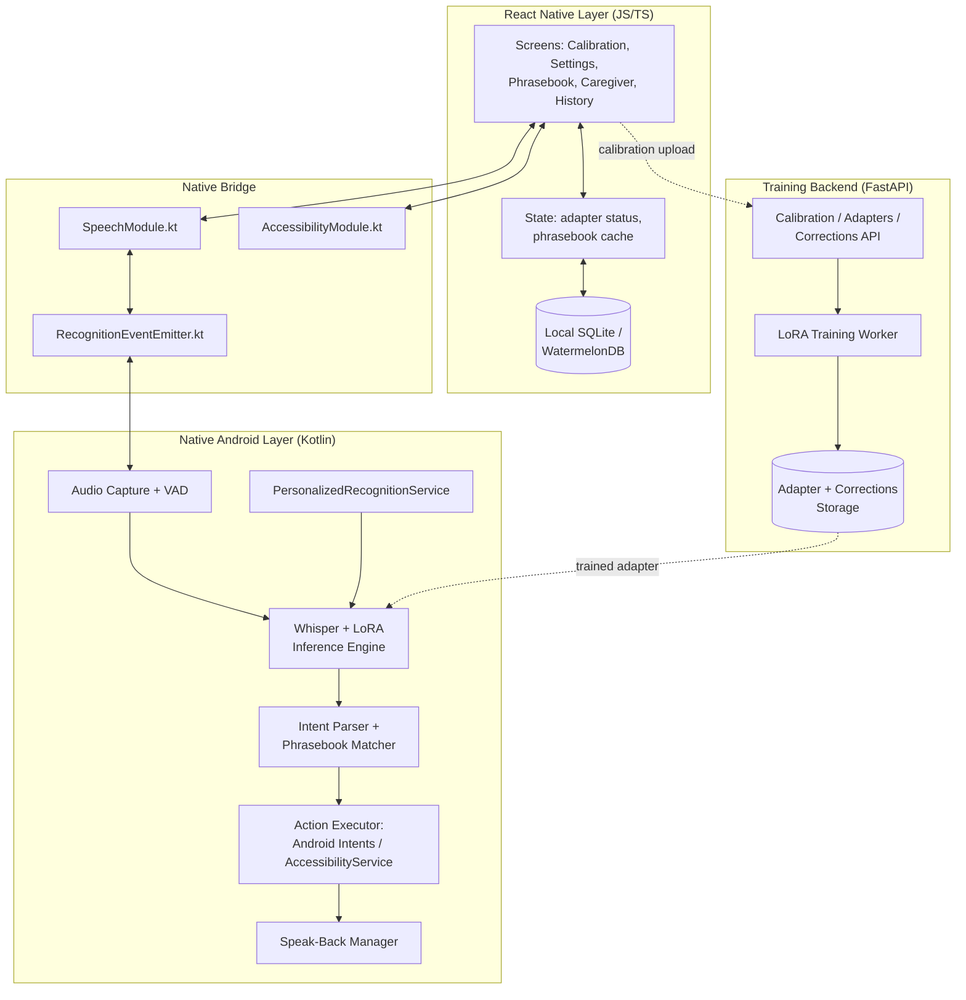
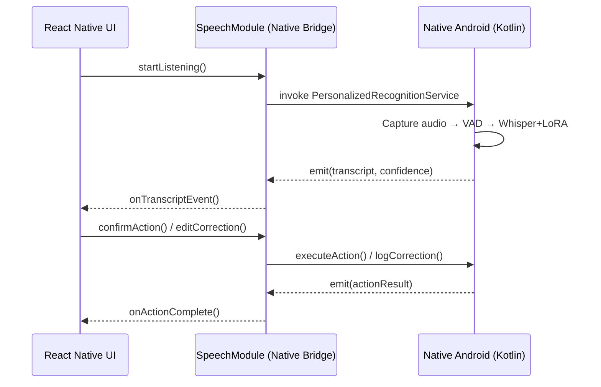
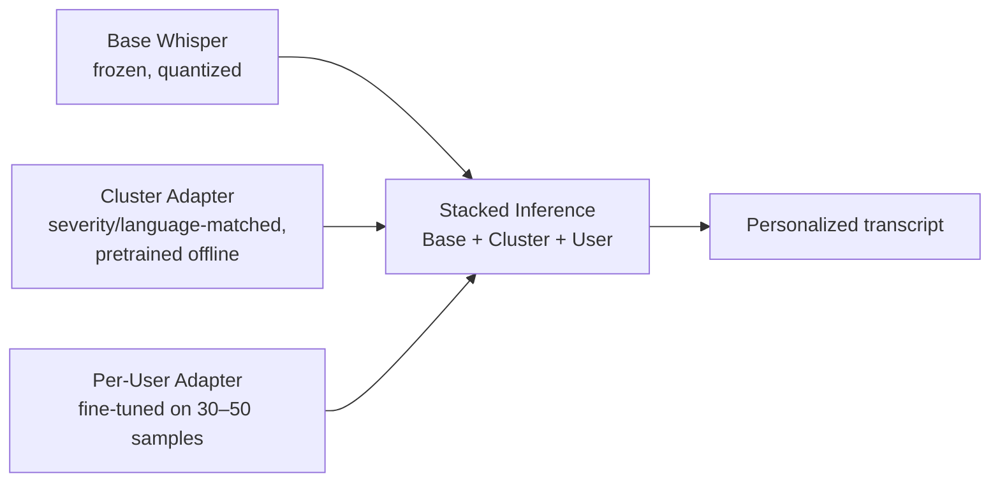
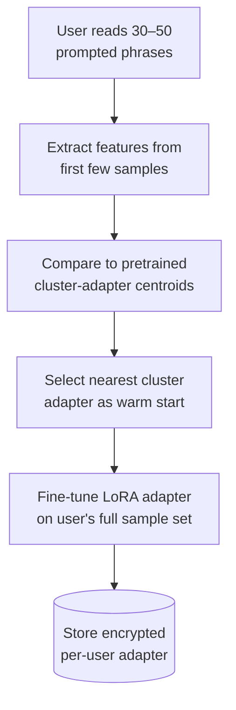
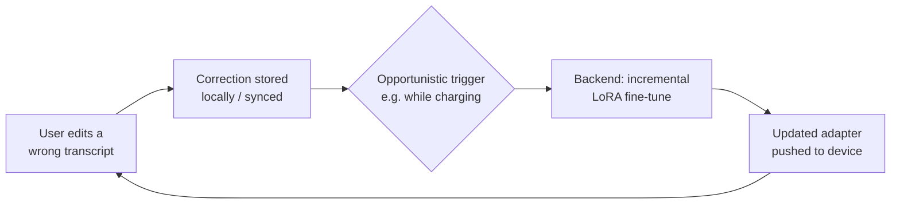
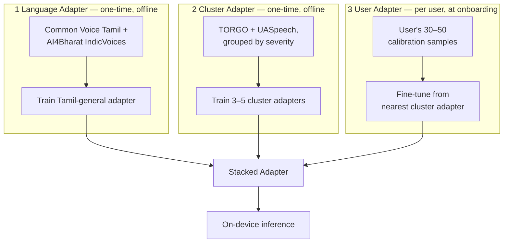

# Vaani — Personalized On-Device Speech Assistant for Dysarthric Speech

> A free, open, fully on-device speech recognition system that personalizes itself to one person's unique speech pattern.

Built for the **~7.5 million people worldwide** with dysarthria — cerebral palsy, stroke, Parkinson's, ALS — whose speech mainstream voice assistants (Siri, Google Assistant) routinely fail to understand.

Voiceitt solved a version of this for English speakers who can pay **$600/year** and sit through lengthy training. **Vaani** solves it for Tamil/Indian-language speakers too — in *minutes, not hours* — for free, entirely on-device, and system-wide instead of locked inside one app.

---

## Table of Contents

1. [Why This Exists](#why-this-exists)
2. [Features](#features)
3. [Why We're Better](#why-were-better)
4. [System Architecture](#system-architecture)
5. [Pipelines & Flowcharts](#pipelines--flowcharts)
6. [ML Training Lifecycle](#ml-training-lifecycle)
7. [Folder Structure](#folder-structure)
8. [Tech Stack](#tech-stack)
9. [Setup](#setup)
10. [Datasets](#datasets)
11. [Data Requirements](#data-requirements)
12. [Honest Limitations](#honest-limitations)
13. [Build Roadmap](#build-roadmap)
14. [License](#license)

---

## Why This Exists

Mainstream voice assistants have documented, well-known failure rates on dysarthric speech. Google's own **Project Euphonia** research targeted this years ago and never shipped as a consumer, self-serve, on-device tool.

**Voiceitt** is a real, shipped alternative — but it's:
- Expensive (**$49.99/mo**)
- Closed-source
- Cloud-hybrid
- Siloed to its own app
- Unclear on Indian-language support

**Tamil dysarthric speech recognition is documented in the literature as an open, largely unsolved problem** — not a shipped product anywhere.

**Vaani closes that specific, named gap.**

---

## Features

###  Core — Assistant Parity
| Feature | Description |
|---|---|
| Voice dictation | Into any text field, in any app |
| Messaging & calls | Send a message or place a call by contact name |
| Reminders | Set alarms and timers |
| Search & launch | Web search / open an app |
| Smart-home stub | Basic smart-home style actions |

###  Personalization — The Actual Thesis
| Feature | Description |
|---|---|
| One-time calibration | 30–50 short recordings → a personal LoRA adapter |
| Cluster-adapter warm start | New users start from a severity + language-matched pretrained adapter instead of zero — cuts calibration from hours to minutes |
| Live before/after comparison | Generic Whisper vs. personalized output, side-by-side, on a held-out phrase |

###  Differentiators — What Makes This Hackathon-Worthy
| Feature | Description |
|---|---|
| Confidence-gated clarification | Low-confidence words trigger a tap-to-confirm prompt instead of a silent wrong guess |
| Personal phrasebook | High-frequency phrases map directly to actions, skipping full parsing |
| Active correction loop | User corrections feed future fine-tuning for that person's adapter |
| Caregiver mode | Companion view to review low-confidence transcripts and manage the phrasebook |
| AAC-lite speak-back | Spoken TTS confirmation before irreversible actions (send/call) fire |
| Tamil–English code-switching | Built for how Indian users actually speak — not assumed monolingual |
| System-wide integration | A registered Android `RecognitionService` — works inside every app's existing mic button, not one silo app |

---

## Why We're Better

| | Voiceitt | Project Euphonia / Relate | **Vaani** |
|---|---|---|---|
| **Cost** | $49.99/mo (~$600/yr) | Free (research, unshipped) | **Free** |
| **Deployment** | Cloud-hybrid | Never shipped self-serve | **Fully on-device at inference** |
| **Scope** | Its own app only | Its own app only | **System-wide, any app** |
| **Language depth** | Unclear outside English/major EU | English-centric | **Explicit Tamil / Indian-language focus** |
| **Onboarding** | Reported time-consuming | N/A | **Cluster-adapter warm start — minutes** |
| **Openness** | Closed-source | Closed / research-only | **Open pipeline (Whisper + peft)** |

---

## System Architecture

The app splits into a **React Native UI layer** and a **native Android layer** — this split is required, not optional, because `RecognitionService` and `AccessibilityService` are Android system classes with no JS/RN equivalent.



---

## Pipelines & Flowcharts

### 1. Speech-to-Action Pipeline (Live Usage)

```mermaid
flowchart TD
    A[ Mic Audio] --> B[VAD: trims silence,<br/>detects utterance boundaries]
    B --> C["Whisper + Personal LoRA Adapter<br/>(runs on NPU)"]
    C --> D[Transcript + Confidence Score]
    D --> E{Confidence /<br/>Phrasebook Check}
    E -->|Low confidence| F[Clarification UI<br/>'Did you mean X or Y?']
    F --> G[User taps to confirm]
    E -->|Phrasebook match| H[Direct action —<br/>skip NLU]
    E -->|Normal| I[Intent Parser<br/>→ action, entities, target_app]
    G --> I
    I --> J{Standard Android<br/>Intent exists?}
    J -->|Yes| K[Fire directly:<br/>SMS / Dial / AlarmManager]
    J -->|No — 3rd-party app| L[AccessibilityService taps/fills<br/>fields on user's behalf]
    H --> M[(optional) TTS speak-back<br/>'Sending message to Ravi...']
    K --> M
    L --> M
    M --> N[User confirms<br/>or action proceeds]
    N --> O{Transcript was wrong?}
    O -->|Yes| P[Correction logged locally]
    O -->|No| Q[Done]
    P --> R[Feeds periodic background<br/>LoRA fine-tune]
```

### 2. React Native ↔ Native Android Bridge



### 3. Two-Adapter Personalization Stack



### 4. Calibration / Onboarding Flow



### 5. Correction → Retraining Loop



---

## ML Training Lifecycle

Three separate training runs happen at three separate times, feeding into **one stacked adapter at inference**:



---

## Folder Structure

```
.
├── mobile-app/                          # React Native app + embedded native Android module
│   ├── src/                             # React Native (JS/TS) — UI, state, networking
│   │   ├── screens/
│   │   │   ├── CalibrationScreen.tsx
│   │   │   ├── SettingsScreen.tsx
│   │   │   ├── PhrasebookScreen.tsx
│   │   │   ├── CaregiverModeScreen.tsx
│   │   │   └── TranscriptHistoryScreen.tsx
│   │   ├── native/
│   │   │   ├── SpeechBridge.ts          # typed wrapper around native module
│   │   │   ├── AccessibilityBridge.ts
│   │   │   └── types.ts
│   │   ├── api/
│   │   │   ├── trainingBackendClient.ts
│   │   │   └── dto.ts
│   │   ├── state/                       # Redux/Zustand — adapter status, phrasebook cache
│   │   ├── storage/
│   │   │   └── localDb.ts               # SQLite / WatermelonDB
│   │   └── App.tsx
│   ├── android/                         # native Android project (required)
│   │   └── app/src/main/java/.../
│   │       ├── audio/
│   │       │   ├── AudioCaptureManager.kt
│   │       │   └── VoiceActivityDetector.kt
│   │       ├── stt/
│   │       │   ├── WhisperInferenceEngine.kt
│   │       │   ├── AdapterManager.kt
│   │       │   └── ConfidenceScorer.kt
│   │       ├── recognition/
│   │       │   └── PersonalizedRecognitionService.kt
│   │       ├── nlu/
│   │       │   ├── IntentParser.kt
│   │       │   └── PhrasebookMatcher.kt
│   │       ├── actions/
│   │       │   ├── ActionExecutor.kt
│   │       │   ├── AndroidIntentActions.kt
│   │       │   └── AccessibilityActionService.kt
│   │       ├── tts/
│   │       │   └── SpeakBackManager.kt
│   │       ├── bridge/
│   │       │   ├── SpeechModule.kt
│   │       │   ├── SpeechModulePackage.kt
│   │       │   ├── AccessibilityModule.kt
│   │       │   └── RecognitionEventEmitter.kt
│   │       └── security/
│   │           └── KeystoreCrypto.kt
│   ├── ios/                             # RN scaffold present; STT/action parity is Android-only
│   └── package.json
│
├── training-backend/                    # FastAPI service
│   ├── app/
│   │   ├── main.py
│   │   ├── routers/
│   │   │   ├── auth.py
│   │   │   ├── calibration.py
│   │   │   ├── adapters.py
│   │   │   ├── corrections.py
│   │   │   └── caregiver.py
│   │   ├── models/                      # Pydantic schemas
│   │   ├── db/                          # SQLAlchemy models + migrations
│   │   ├── workers/
│   │   │   └── train_worker.py
│   │   └── storage/                     # object storage client
│   ├── ml/
│   │   ├── train_lora_whisper.py
│   │   └── adapters/                    # seed adapters (e.g. torgo_cluster_english_v1/)
│   └── requirements.txt
│
├── notebooks/
│   └── torgo_whisper_lora_colab.ipynb   # standalone Colab training notebook
│
└── docs/
    ├── dysarthric-asr-implementation.md      # product architecture, features, demo script
    └── technical-implementation-spec.md      # full API contracts, schemas, sequence flows
```

---

## Tech Stack

| Layer | Technology |
|---|---|
| Mobile UI | React Native (TypeScript) |
| Native Android bridge | Kotlin, React Native Native Modules + Event Emitters |
| STT | OpenAI Whisper (small/base, multilingual), quantized |
| On-device inference | ONNX Runtime Mobile (QNN execution provider) or whisper.cpp, running on Snapdragon NPU |
| Personalization | LoRA via  `peft` |
| System integration | `android.speech.RecognitionService`, `android.accessibilityservice.AccessibilityService` |
| TTS | Android system `TextToSpeech` |
| Local storage | Room DB (native) + SQLite/WatermelonDB (RN) |
| Backend | Python, FastAPI |
| Backend DB | SQLAlchemy (Postgres/SQLite) |
| Training |  `transformers`, `datasets`, `peft`, `accelerate`, `jiwer` |
| Caregiver dashboard | React (optional) |
| Security | Android Keystore-backed encryption at rest |

---

## Setup

### Training backend
```bash
cd training-backend
pip install -r requirements.txt
uvicorn app.main:app --reload
```

### LoRA training (standalone / Colab)
```bash
cd training-backend/ml
pip install transformers datasets peft accelerate jiwer soundfile librosa evaluate
python train_lora_whisper.py
```
Or open `notebooks/torgo_whisper_lora_colab.ipynb` directly in Google Colab for a guided, cell-by-cell run.

### Mobile app
```bash
cd mobile-app
npm install
npx react-native run-android   # requires a physical device for RecognitionService/NPU testing
```

On first launch, set the app as the system voice input method:
`Settings → System → Languages & input → Voice input`

---

## Datasets

| Dataset | Purpose | Access |
|---|---|---|
| TORGO | English dysarthric cluster-adapter pretraining | Free — [cs.toronto.edu/~complingweb/data/TORGO](http://cs.toronto.edu/~complingweb/data/TORGO), or [HF mirror](https://huggingface.co/datasets/abnerh/TORGO-database) |
| UASpeech | English dysarthric, severity-labeled | Requires signed license agreement (University of Illinois) |
| Common Voice — Tamil | Language adapter (general Tamil accuracy) | Free — [commonvoice.mozilla.org](https://commonvoice.mozilla.org) |
| AI4Bharat IndicVoices / IndicVoices-R (Tamil) | Language adapter, natural Tamil speech | Free — [HF dataset](https://huggingface.co/datasets/ai4bharat/IndicVoices) |
| Tamil dysarthric speech | — | **Does not publicly exist.** This project uses disclosed proxy-speaker recordings for the Tamil demo — a genuine gap, stated openly rather than worked around. |

---

## Data Requirements

| Adapter | Data Needed | Why |
|---|---|---|
| Language adapter (Tamil general) | 5–20 hours of clean Tamil speech | Closes Whisper's baseline weakness on Tamil, not dysarthria specifically — one-time cost |
| Cluster adapter (severity-matched) | Full available TORGO subset per severity group | Gives new users a far better starting point than raw Whisper |
| User adapter (per-person) | 30–50 short phrases (~5–10 min audio) | Visible improvement on calibration-similar phrases — not full clinical-grade generalization |

**Literature reference point:** full fine-tuning took a 128% WER baseline (unusable) down to 15.8% with just 1.4 hours of data, and to 9.7% with ~22.5+ hours. Our 30–50 sample calibration set sits well below the 1.4-hour mark by design — the claim is *"visibly better, in minutes,"* not *"clinically solved."*

---

## Honest Limitations

- Calibration samples are recorded and reviewed before live demos, not collected on stage.
- On-device training is **not** implemented — all adapter fine-tuning happens on the backend; the phone runs inference only.
- LoRA is used over full fine-tuning as a deliberate storage/scalability tradeoff (per-user adapters vs. per-user full models) — literature shows full fine-tuning can outperform LoRA in raw accuracy on this task.
- Tamil dysarthric demos rely on a proxy speaker mimicking dysarthric speech patterns, not a clinically validated dataset.
- This closes a **personalization gap for individual users** — it is not a claim of general-purpose ASR robustness.
- The React Native ↔ native Android bridge is the highest-risk integration point in this stack; a native fallback demo path should always be kept ready.

---

## Build Roadmap

- [ ] Backend: auth, calibration routers + DB models
- [ ] `train_lora_whisper.py` wired into `train_worker.py`
- [ ] Native Android: raw STT pipeline (base Whisper only) as a standalone test harness
- [ ] Native ↔ RN bridge scaffolding (`SpeechModule`, `RecognitionEventEmitter`) — highest risk, build and test early
- [ ] RN: minimal screen calling `transcribeFile()` to prove the bridge end-to-end
- [ ] Native: `AdapterManager` + backend adapters router — personalization wired in
- [ ] Native: `PersonalizedRecognitionService` registration — system-wide dictation
- [ ] Native: `IntentParser` + `ActionExecutor` (Android Intents first, AccessibilityService fallback later)
- [ ] Native: `SpeakBackManager` (system TTS) confirmation flow
- [ ] RN: full `CalibrationScreen` + `PhrasebookScreen` flows
- [ ] Corrections capture + opt-in sync
- [ ] Caregiver dashboard — if time remains

---

## License

Choose and add a license (**MIT** or **Apache-2.0** recommended for the open-source positioning this project is built around).
